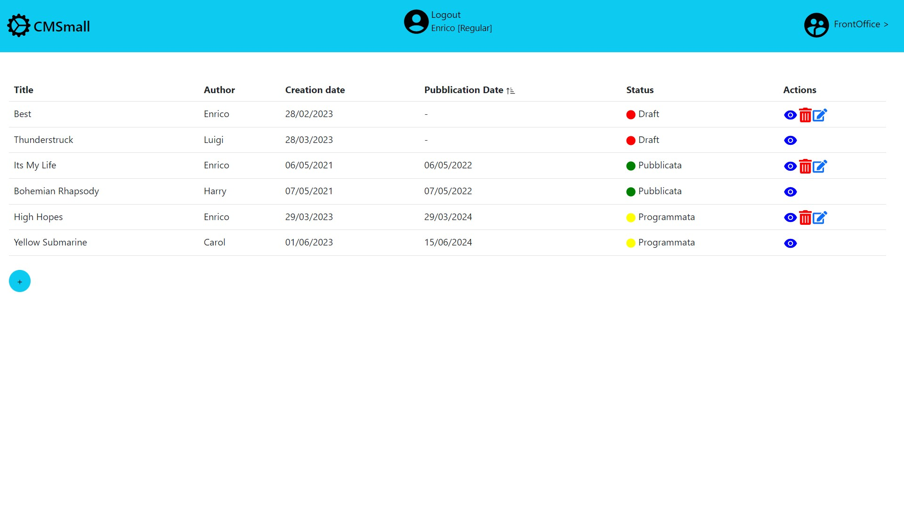
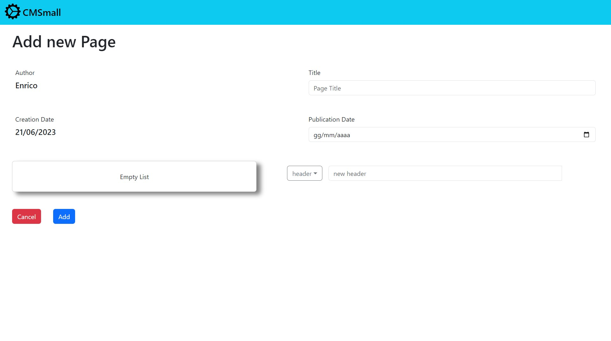

# Exam #1: "CMSmall"
## Student: MATASSA PAOLA

## React Client Application Routes

- Route `/`: pagina di frontOffice per vedere la lista di pagine pubblicate
- Route `/backOffice`: pagina di backOffice per vedere la lista di tutte le pagine 
- Route `/pageView/:id` : pagina contenente le informazioni e i blocchi relativi ad una pagina specifica
- Route `/add` : pagina con il form per la creazione di una nuova pagina
- Route `/edit/:id` : pagina con il form per la modifica di una pagina
- Route `/login` : pagina per il login

## API Server

### Autenticazione

- POST `/api/session`

  - Description: Permette di eseguire il login di un utente.

  - Request body: _None_

  - Response: `200 OK` (successo), `401 Unauthorized` (credenziali errate).

  - Response body: un oggetto contenente le informazioni relative l'utente appena loggato
    ```
    {
      "id": 2,
      "username": "luigi@test.com",
      "name": "Luigi",
      "role": "Admin"
    }
    ```
- DELETE `/api/sessions/current`

  - Description: Permette di eseguire il logout di un utente.

  - Request body: _None_

  - Response: `200 OK` (successo), `500 Internal Server Error` (errore generico)

  - Response body: _None_

- GET `/api/sessions/current`

  - Description: Permette di ottenere le informazioni sull'utente attualmente loggato.

  - Request body: _None_

  - Response: `200 OK` (successo), `401 Unauthorized` (utente non autenticato)

  - Response body: un oggetto contenente le informazioni sullo user loggato

  ```

    {
      "id": 2,
      "name": "Luigi",
      "role": "Admin
    }

  ```

### Altre

- GET `/api/pages`

  - Description: Permette di visualizzare la lista di tutte le pagine se l'utente è loggato.

  - Request body: _None_

  - Response: `200 OK` (successo), `500 Internal Server Error` (errore generico), `401 Unauthorized` (utente non autenticato)

  - Response body: un oggetto contenente una lista di oggetti ognuno dei quali contiene le informazioni relative ad ogni pagina
    ```
    [
      {
        "id": 1,
        "title": "Best way",
        "author": "Enrico",
        "createDate": "2023-02-28",
        "pubDate": null,
        "userId": 1
      },
      {
        "id": 2,
        "title": "Its my life",
        "author": "Enrico",
        "createDate": "2021-05-06",
        "pubDate": "2022-05-06",
        "userId": 1
      },
      ...
    ]
    ```
- GET `/api/publicatePages`

  - Description: Permette di visualizzare la lista delle sole pagine pubblicate anche agli utenti non loggati

  - Request body: _None_

  - Response: `200 OK` (successo), `500 Internal Server Error` (errore generico).

  - Response body: una lista di oggetti ognuno dei quali contiene le informazioni relative ad ogni pagina
    ```
    [
      {
        "id": 2,
        "title": "Its my life",
        "author": "Enrico",
        "createDate": "2021-05-06",
        "pubDate": "2022-05-06",
        "userId": 1
      },
      {
        "id": 3,
        "title": "Bohemian rhapsody",
        "author": "Harry",
        "createDate": "2021-05-07",
        "pubDate": "2022-05-07",
        "userId": 4
      }
      ...
    ]
    ```
- GET `/api/pages/<id>`

  - Description: Permette di visualizzare la pagina corrispondente all'id 

  - Params: id della pagina da cercare

  - Request body: _None_

  - Response: `200 OK` (successo), `500 Internal Server Error` (errore generico).

  - Response body: una lista con un oggetto contenente le informazioni relative la pagina
    ```
    [
      {
        "id": 1,
        "title": "Best way",
        "author": "Enrico",
        "createDate": "2023-02-28",
        "pubDate": null,
        "userId": 1
      }
    ]
    ```
- GET `/api/pageContents/<id>`
  
  - Description: Permette di visualizzare i contenuti della pagina corrispondente all'id 

  - Params: id della pagina da cercare

  - Request body: _None_

  - Response: `200 OK` (successo), `500 Internal Server Error` (errore generico).

  - Response body: una lista di oggetti contenenti le informazioni relative i blocchi della pagina
    ```
    [
      {
        "id": 1,
        "type": "header",
        "internal": "hello",
        "pageId": 1,
        "pOrder": 1
      },
      {
        "id": 5,
        "type": "image",
        "internal": "image1.jpg",
        "pageId": 1,
        "pOrder": 2
      },
      ...
    ]
    ```
- GET `/api/title`
  - Description: Permette di visualizzare il titolo del sito 

  - Request body: _None_

  - Response: `200 OK` (successo), `500 Internal Server Error` (errore generico).

  - Response body: una lista con un oggetto contenente il titolo
    ```
    [
      {
        "title": "CMSmall"
      }
    ]
    ```
- GET `/api/imagesAndUsers`
  - Description: Permette di visualizzare la lista degli utenti registrati e la lista dei nomi delle immagini salvate nel database

  - Request body: _None_

  - Response: `200 OK` (successo), `401 Unauthorized` (l'utente non è autenticato) , `500 Internal Server Error` (errore generico).

  - Response body: due oggetti contenti: la lista di oggetti dei nomi e degli id degli utenti registrati, la lista di nomi delle immagini nel database
    ```
    {
    "users": [
        {
            "id": 1,
            "name": "Enrico"
        },
        {
            "id": 2,
            "name": "Luigi"
        },
        ...
    ],
    "images": [
        {
            "name": "image1.jpg"
        },
        {
            "name": "image2.jpg"
        },
        ...
      ]
    }
    ```

- POST `/api/page`
  - Description: Permette agli utenti autenticati di creare una pagina di cui sono autori (se sono utenti "regular") o appartente ad altri autori (se sono "admin")

  - Request body: un oggetto contenente il campo page con tutte le informazioni della nuova pagina, e un campo blocks contenente una lista di oggetti ognuno dei quali corrispondente ad un nuovo blocco da aggiungere al database
  ```
    {
      "page":
      {
        "title": "newPage",
        "author": "Luigi",
        "userId": 2,
        "createDate": "2023-05-06",
        "pubDate": "2023-05-10"
      },
      "blocks":
      [
        {
          "internal": "header1",
          "pOrder": 1,
          "type": "header"
        },
        {
          "internal": "paragraph1",
          "pOrder": 2,
          "type": "paragraph"
        }
      ]
    }
    ```

  - Response: `201 Created ` (successo), `401 Unauthorized` (l'utente non è autenticato oppure non è un admin e sta cercando di creare una pagina di cui non è l'autore), `422 Unprocessable Entity`(errore di validazione), `404 Not Found`(id della pagina da modificare non esiste),`500 Internal Server Error` (errore generico).

  - Response body: _None_ 

- PUT `/api/title`
  - Description: Permette agli admin di modificare il nome del sito

  - Request body: un oggetto contente il nuovo nome del sito
      ```
    {"title": "newName"}
    ```

  - Response: `201 Created ` (successo), `401 Unauthorized` (l'utente non è un admin oppure non è autenticato), `422 Unprocessable Entity`(errore di validazione), `500 Internal Server Error` (errore generico).

  - Response body: _None_

- PUT `/api/page/<id>`
  - Description: Permette agli utenti autenticati di modificare una pagina di cui sono autori (se sono utenti "regular") o appartente ad altri autori (se sono "admin")

  - Params: l'id della pagina da modificare

  - Request body: un oggetto contenente il campo page con tutte le nuove  informazioni della pagina e tre campi opzionali addBlocks, upBlocks e delBlocks ognuno dei quali è una lista di oggetti corrispondenti, rispettivamente, ai blocchi da aggiungere, modificare e cancellare per quella pagina
  ```
    {
      "page":
      {
        "id": 7,
        "title": "newPageChanged",
        "author": "Luigi",
        "userId": 2,
        "createDate": "2023-05-06",
        "pubDate": "2023-05-10"
      },
      "addBlocks":
      [
        {
          "internal": "newHeader",
          "pOrder": 3,
          "type": "header"
        },
        {
          "internal": "image1.jpg",
          "pOrder": 2,
          "type": "image"
        }
      ],
      "upBlocks":
      [
        {
          "id": 16,
          "internal": "paragraphChanged",
          "pOrder": 1,
          "type": "paragraph",
          "pageId": 7
        }
      ],
      "delBlocks":
      [
        {
          "id": 15,    
          "internal": "header1",
          "pOrder": 1,
          "type": "header",
          "pageId": 7
        }
      ]
    }
    ```

  - Response: `201 Created ` (successo), `401 Unauthorized` (l'utente non è autenticato oppure non è un admin e sta cercando di modificare una pagina di cui non è l'autore), `422 Unprocessable Entity`(errore di validazione) ,`500 Internal Server Error` (errore generico).

  - Response body: un oggetto contente l'id della pagina modificata
  
- DELETE `/api/page/<id>`

  - Description: Permette di eseguire l'eliminazione di una pagina e dei suoi blocchi dal database.

  - Params: id della pagina da eliminare

  - Request body: _None_

  - Response: `201 Created ` (successo), `401 Unauthorized` (l'utente non è autenticato oppure non è un admin e sta cercando di eliminare una pagina di cui non è l'autore), `422 Unprocessable Entity`(errore di validazione), `404 Not Found`(id della pagina da eliminare non esiste),`500 Internal Server Error` (errore generico).

  - Response body: _None_

## Database Tables

- Table `users` (id, email, name, role, salt, password): tabella contenente le informazioni sugli utenti registrati
- Table `pages` (id, title, author, createDate, pubDate, userId): tabella contenente le informazioni sulle pagine salvate
- Table `blocks` (id, type, internal, pageId, pOrder): tabella contenente le informazioni su tutti i contenuti di ogni pagina
- Table `images` (id, name): tabella contenente i nomi delle immagini salvate 
- Table `settings` (id, title): tabella contenente il nome del sito

## Main React Components

- `MyTable` (in `myTable.jsx`): componente che permette la visualizzazione della lista di pagine sia da guest che da user e di accedere a tutte le altre azioni possibili
- `VisualizePage` (in `visualizePage.jsx`): componente che permette di visualizzare le informazioni e i blocchi di una specifica pagina
- `MyForm` (in `myForm.jsx`): componente contenente il form per la creazione e la modifica delle pagine
- `Login` (in `login.jsx`): componente contenente il form per eseguire il login

## Screenshot




## Users Credentials

* username: enrico@test.com, password: "pwd", role: "Regular"
* username: luigi@test.com, password: "pwd", role: "Admin"
* username: alice@test.com, password: "pwd", role: "Regular"
* username: harry@test.com, password: "pwd", role: "Admin"
* username: carol@test.com, password: "pwd", role: "Regular"

